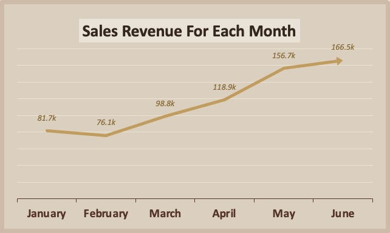
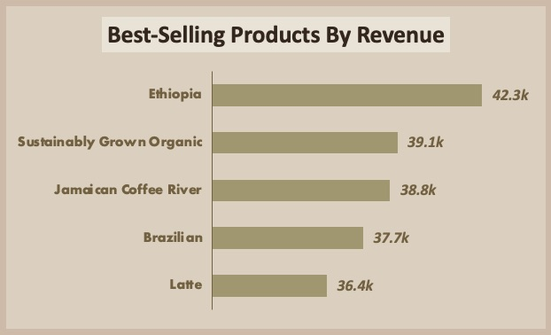
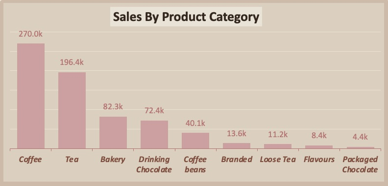
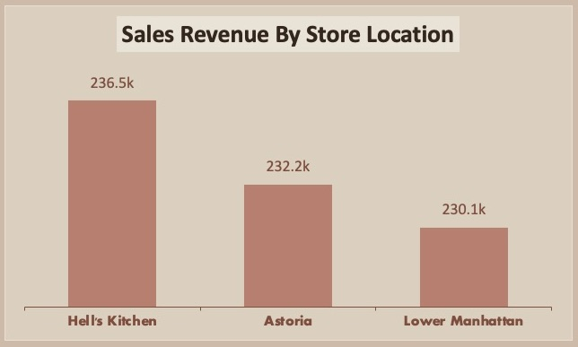

# Coffee Shop Sales Analysis ☕️

## Comprehensive Overview- 
The analysis provides a thorough examination of coffee sales, highlighting trends over time, across different product categories, and between various store locations.

### Key Insights 🔍
- **Revenue Growth**: Monthly sales show a positive trend, indicating increased customer demand.
- **Top Products**: Certain items dominate sales, highlighting customer preferences.
- **Category Leaders**: Coffee and tea categories drive the majority of sales.
- **Location Performance**: Hell's Kitchen store leads in revenue, suggesting successful location strategies.

---

### Questions I Answered- 📋
### 1. What is the total sales revenue for each month? 📈
The line chart displays the monthly sales revenue from January to June. It shows a steady increase in revenue over these months, indicating a growing customer demand throughout the period.

---

### 2. Which products are the best-selling in terms of revenue? 📊
The horizontal bar chart highlights the top 5 best-selling products. These products lead in sales, making significant contributions to the overall revenue.

---

### 3. How do sales vary by product category? 📊
The vertical bar chart displays the top 10 sales figures by product category, with coffee and tea leading at 270.0k and 196.4k, respectively, representing the majority of sales, while flavors and packaged chocolate contribute the least.

---

### 4. How do sales vary across different store locations? 📊
The vertical bar chart highlights that the Hell's Kitchen store has the highest sales revenue at 236.5k, followed closely by Astoria and Lower Manhattan.

---

### 5. How do sales vary by hour of the day?
Sales peak between 9 AM and 12 PM, reflecting typical morning rush hours. A sharp decline is observed after 3 PM.

### 6. Which day of the week has the highest total count of orders?
Friday stands out with the highest total count of orders, followed by Thursday and Monday.

### 7. What is the average cost per person?
The average cost per person is $4.69, indicating the typical expenditure on coffee products per visit.

### 8. What is the average order per person?
On average, each customer places about 1.44 orders.

---

## Tools I Used ⚙️
- **Microsoft Excel:** For data analysis and dashboard creation.
- **VSCode:** For writing and editing markdown file, and pushing the project to GitHub.
- **Operating System:** Windows & MacOS

## Data Source ⛁
The raw data I used in this project is taken from [Maven Analytics](https://mavenanalytics.io/data-playground).

## Contact 📩
*For any questions or feedback, you can reach me at:*

**[Email](mailto:ayeshazubair047@gmail.com)**

**[Linkedin](https://www.linkedin.com/in/ayeshazubair-az)**

----
